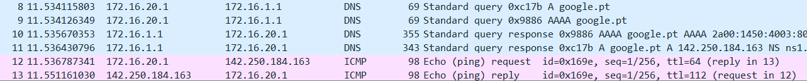

# 1. Experience 5: DNS

The objective of this experience is to (...)

## Table of Contents<!-- omit in toc -->

- [1. Experience 5: DNS](#1-experience-5-DNS)
  - [1.1. Plan](#11-plan)
  - [1.2. Overview](#12-overview)
  - [1.3. Questions](#13-questions)

***

## 1.1. Plan

Configuring the DNS in each *tux*
```bash
echo $'search netlab.fe.up.pt\nnameserver 172.16.1.1' > /etc/resolv.conf
```

## 1.2. Overview

TODO

***


## 1.3 Questions

### How to configure the DNS service at an host?

In order to configure the DNS service, it is necessary to change the resolv.conf file, which is present in the etc/ directory in the host TUX. 
That file will need to have present the following information:  
    
    search netlab.fe.up.pt
    nameserver 172.16.1.1

Where __netlab.fe.up.pt__ is the name of the DNS server and 172.16.1.1 its IP address. 


### What packets are exchanged by DNS and what information is transported

Initially, the host sends a packet to the server (line 8 ), which contains the desired _hostname_, asking for its IP address.  
The server responds with a packet that contains the IP address of the _hostname_ (line 11).



