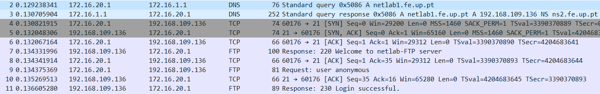

# 1. Experience 6: TCP Connections  

In this experiment the TCP protocol's behavior was observed using the application developed in the first stage of the work.

## Table of Contents<!-- omit in toc -->

- [1. Experience 6: TCP Connections](#1-experience-6-TCP-Connections)
  - [1.1. Plan](#11-plan)
  - [1.2. Overview](#12-overview)

***

## 1.1. Plan

Compiling our application in *tux3*

```bash
# While in the root of the application directory
make
```

## 1.2. Overview


Our FTP application opens two TCP connections: one for control, to send the FTP commands to the server (and receive the responses) and one to receive the data sent by the server.

The FTP control information is transported in the _control_ connection, i.e. the one responsible for sending the commands to the server.

A TCP connection has three phases: establishment of the connection, data transfer and connection termination.

TCP (Transmission Control Protocol) utilizes the ARQ (Automatic Repeat Request) mechanism with the _Sliding Window_ method. That way, it uses:
- __acknowledgment numbers__ - represented by the field _Ack_, which are present in one of the fields of the messages sent by the receptor which indicate which frame was received correctly;
- __window size__ - represented by the field _Win_, which indicates the range of packets that the emitter can send;
- __sequence number__ - represented by the field _Seq_, which represents the number of the frame to be sent. 




### How does the TCP congestion control mechanism work? What are the relevant fields? How did the throughput of the data connection evolve along the time? Is it according the TCP congestion control mechanism?
// TODO


With the appearance of a second TCP connection, the existence of a simultaneous data transfer can lead to a drop in the transmission rate, since the transfer is distributed equally for each connection.
